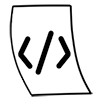

# Keyboard Shortcuts

_`Last Updated: 2/16/2022`_ [`edit`](https://github.com/dandalpiaz/dandalpiaz.github.io/edit/master/pages/keyboard-shortcuts.md) [`home`](https://dandalpiaz.github.io/)

A list of keyboard shortcuts I frequently use, or can't seem to remember in some cases.

## Table of Contents

- [Chrome](#chrome)
- [Outlook](#outlook)
- [VS Code](#vs-code)
- [Windows](#windows)

## Chrome

| **Function**   | **Keys**            |
| -------------- | ------------------- |
| Go back        | `Alt + left arrow`  |
| Refresh        | `Ctl + r` or `F5`   |
| New tab        | `Ctl + t`           |
| Close tab      | `Ctl + w`           |

## Outlook

| **Function**               | **Keys**                 |
| -------------------------- | ------------------------ |
| Move message to folder     | `Ctl + Shift + v`        |

## VS Code

| **Function**               | **Keys**                 |
| -------------------------- | ------------------------ |
| Focus on explorer          | `Ctl + 0`                |
| Markdown preview           | `Ctl + Shift + v`        |
| Open directory             | `Ctl + k` then `Ctl + o` |
| Close tab                  | `Ctl + w`                |
| Open/close terminal        | ``Ctl + ` ``             |

## Windows

| **Function**               | **Keys**                |
| -------------------------- | ----------------------- |
| Open file explorer         | `Win + e`               |
| Min/(Max) current window   | `Win + down arrow (up)` |
| Right click                | `Shift + F10`           |
| Close current window       | `Alt + F4`              |
| (Un)Minimize windows       | `Win + (Shift) + m`     |
| Switch window              | `Alt + Tab`             |
